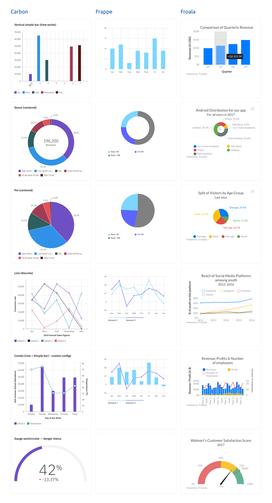

# Svelte Charts Example
A single-page web app to try different charts libraries for Svelte and compare them.

## Chart Libraries Used

### Carbon/Charts

[Docs](https://carbon-design-system.github.io/carbon-charts/?path=/story/docs--welcome) | [GitHub](https://github.com/carbon-design-system/carbon-charts#readme) | [npm](https://www.npmjs.com/package/@carbon/charts-svelte)

```bash
yarn add @carbon/charts @carbon/charts-svelte d3@5.x carbon-components
# or
npm install -S @carbon/charts @carbon/charts-svelte d3@5.x carbon-components
```

### Frappe
[Docs](https://frappe.io/charts/docs) | [GitHub](https://github.com/himynameisdave/svelte-frappe-charts#readme) | [npm](https://www.npmjs.com/package/svelte-frappe-charts)

```bash
yarn add svelte svelte-frappe-charts
# or
npm i -S svelte svelte-frappe-charts
```

### Froala
[Docs](https://froala.com/charts/docs/frameworks/svelte/)

```bash
yarn add svelte-froalacharts froalacharts
# or
npm install svelte-froalacharts froalacharts --save
```

## Screenshot
